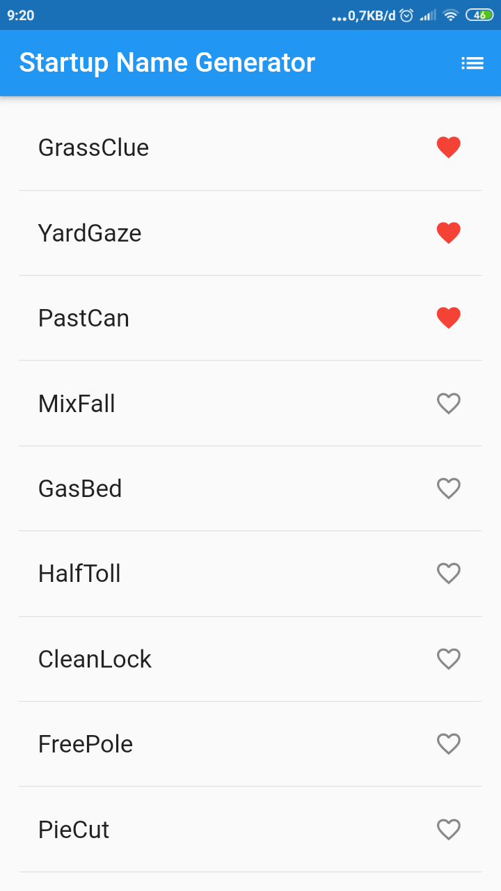
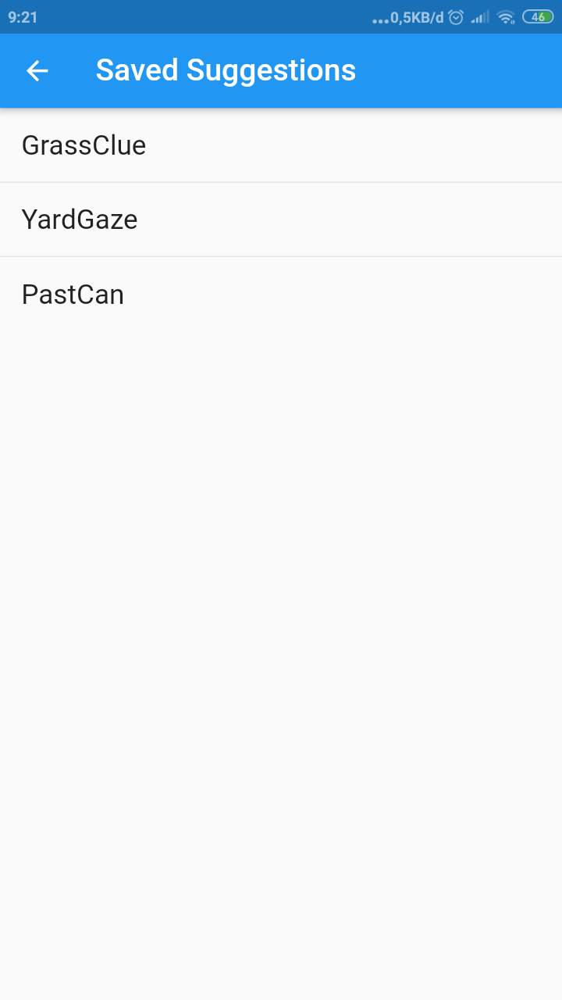

# startup_namer

A new Flutter project.

## Getting Started


 1 .Menambahkan dependensi english `english_words: ^3.1.0` pada pubspec.yaml
```dart
dependencies:
  flutter:
    sdk: flutter
  cupertino_icons: ^0.1.2
  english_words: ^3.1.0
```

2.Menmbahkan package english_words di dart main.dart
```dart 
import 'package:english_words/english_words.dart';
```


3.Menampilan  scroll list view english words

```dart
void main() => runApp(MyApp());

class RandomWordsState extends State<RandomWords> {
  final _suggestions = <WordPair>[];
  final _biggerFont = const TextStyle(fontSize: 18.0);

  @override
  Widget build(BuildContext context) {
    return Scaffold(
      appBar: AppBar(
        title: Text('Startup Name Generator'),
      ),
      body: _buildSuggestions(),
    );
  }

  Widget _buildSuggestions() {
    return ListView.builder(
        padding: const EdgeInsets.all(16.0),
        itemBuilder: (context, i) {
          if (i.isOdd) return Divider();

          final index = i ~/ 2;
          if (index >= _suggestions.length) {
            _suggestions.addAll(generateWordPairs().take(10));
          }
          return _buildRow(_suggestions[index]);
        });
  }

  Widget _buildRow(WordPair pair) {
    return ListTile(
      title: Text(
        pair.asPascalCase,
        style: _biggerFont,
      ),
    );
  }
}

class RandomWords extends StatefulWidget {
  @override
  RandomWordsState createState() => RandomWordsState();
}

class MyApp extends StatelessWidget {
  @override
  Widget build(BuildContext context) {
    return MaterialApp(
      title: 'Startup Name Generator',
      home: RandomWords(),
    );
  }
}
```


 4.Menambahkan icon favorite di list
```dart
Widget _buildRow(WordPair pair) {
  final bool alreadySaved = _saved.contains(pair);
  return ListTile(
    title: Text(
      pair.asPascalCase,
      style: _biggerFont,
    ),
    trailing: Icon(
      alreadySaved ? Icons.favorite : Icons.favorite_border,
      color: alreadySaved ? Colors.red : null,
    ),
  );
}
```
 5.Menambahkan fungsi `onTap()`
```dart
Widget _buildRow(WordPair pair) {
  final alreadySaved = _saved.contains(pair);
  return ListTile(
    title: Text(
      pair.asPascalCase,
      style: _biggerFont,
    ),
    trailing: Icon(
      alreadySaved ? Icons.favorite : Icons.favorite_border,
      color: alreadySaved ? Colors.red : null,
    ),
    onTap: () {
      setState(() {
        if (alreadySaved) {
          _saved.remove(pair);
        } else {
          _saved.add(pair);
        }
      });
    },
  );
}
```

 5.Menambahkan fungsi `_pushSaved` untuk menyimpan list pada kelas `RandomWordState`

 ```dart
 void _pushSaved() {
  Navigator.of(context).push(
    MaterialPageRoute<void>(
      builder: (BuildContext context) {
        final Iterable<ListTile> tiles = _saved.map(
          (WordPair pair) {
            return ListTile(
              title: Text(
                pair.asPascalCase,
                style: _biggerFont,
              ),
            );
          },
        );
        final List<Widget> divided = ListTile
          .divideTiles(
            context: context,
            tiles: tiles,
          )
              .toList();

        return Scaffold(         // Add 6 lines from here...
          appBar: AppBar(
            title: Text('Saved Suggestions'),
          ),
          body: ListView(children: divided),
        );                       // ... to here.
      },
    ),
  );
}
 ```

<!-- 
 -->
