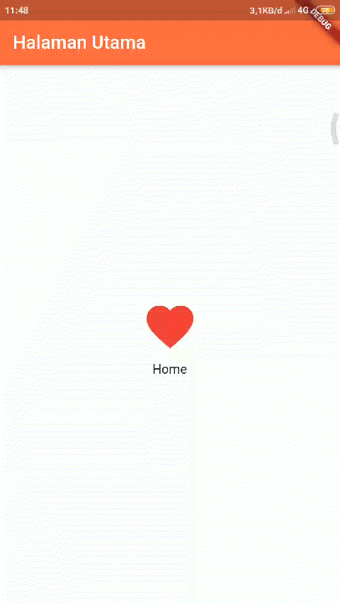

# simpleroute_statelesswidget

A new Flutter project.

## Getting Started


1.kelas ``HomePage()`` menggunakan StatelessWidget 

```dart
class HomePage extends StatelessWidget{
  @override
  
  Widget build(BuildContext context) {
    return new Scaffold(
      appBar: new AppBar(title: new Text("Halaman Utama"),backgroundColor: Colors.deepOrangeAccent,),
      body: new Container(
        child: new Center(
          child: Column(
            mainAxisAlignment: MainAxisAlignment.center,
            children: <Widget>[
              new IconButton(
                icon: new Icon(Icons.favorite, color: Colors.red),
                iconSize: 70.0,
                onPressed: (){
                  Navigator.of(context).pushNamed("/SecondPage");}
              ),
              new Text("Home")
            ],
          ),
        ),
      ),
    );//Scafold
  }
}
```


Menggunkan anonymous method ``onPressed:`` pada widget ``IconButton()`` untuk pindah ke halaman SecondaPage

```dart
new IconButton(
                icon: new Icon(Icons.favorite, color: Colors.red),
                iconSize: 70.0,
                onPressed: (){
                  Navigator.of(context).pushNamed("/SecondPage");}
              ),

```

2.Membuat kelas ``SecondPage()`` menggunkan StatelessWidget

```dart
class SecondPage extends StatelessWidget{

  @override
  Widget build(BuildContext context) {
    return new Scaffold(
      appBar: new AppBar(title: new Text("Second Page"),backgroundColor: Colors.deepOrange),
      body: new Container(

        child: new Center(
          child: new Column(
            mainAxisAlignment: MainAxisAlignment.center,
            children: <Widget>[
              new IconButton(
                icon: new Icon(Icons.home, color: Colors.indigo),
                iconSize: 70.0,
                onPressed: null,
              ),
              new Text("Second Page")
            ],
          ),
        ),
      ),
    );
  }
```
output:
  


