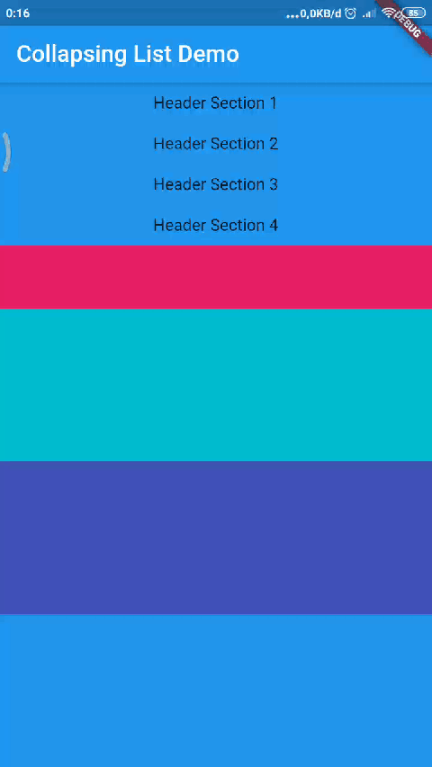

## Sliver
A sliver is a portion of a scrollable area. You can use slivers to achieve custom scrolling effects.

menambahkan class header


```dart
class Header extends StatelessWidget {

  Header(
    this.headerText,{
      Key key,
    } ) : super(key:key);

    GlobalKey globalKey = new GlobalKey();

    final String headerText;

    void collaps(){
        Scrollable.ensureVisible(globalKey.currentContext);
    }


  @override
  Widget build(BuildContext context) {
    return GestureDetector(
      key: globalKey,
      onTap: collaps,
      child: Container(
      color: Colors.blue,
      child: Center(child: Text(headerText),),

      ),
      
    );
  }
}
```


